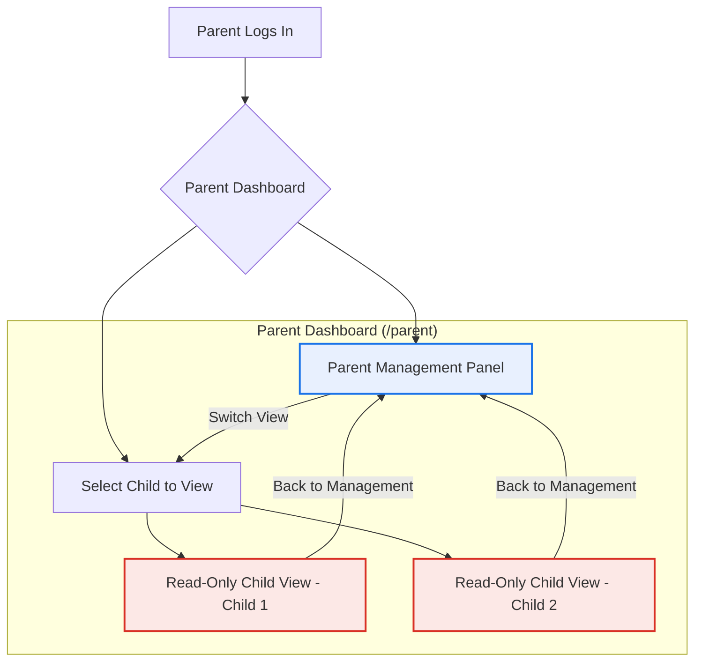

# MotivTrack UI/UX Specification

This document outlines the corrected understanding of the UI/UX requirements based on your feedback. It will serve as the source of truth for the frontend refactor.

---

## 1. Color Palette

The color scheme will be based on the **Google Classroom Palette** combined with the **Joyful Holly Gradient**.

```javascript
const COLORS = {
  // Joyful Holly Gradient
  gradient: 'linear-gradient(to right, #146735, #EAFDD8)',

  // Google Classroom official brand colors
  primary: '#25A667',        // Classroom green
  accent: '#57BB8A',         // Secondary Classroom green
  highlight: '#F6BB18',      // Classroom yellow

  // UI neutrals / support colors (not officially listed on the Classroom branding page)
  textPrimary: '#202124',
  textSecondary: '#5f6368',
  background: '#f8f9fa',
  error: '#d93025',
};
```

---

## 2. View Architecture & Role Permissions

This section details what each user role can see and do. The key insight is that parents have a multi-faceted view.

### User Roles
- `child`: Can only see their own interactive dashboard.
- `teacher`: Can only see their student rating interface.
- `delivery_parent`: A parent with limited permissions.
- `admin_parent`: A parent with full permissions.

### View Breakdown

#### 👶 Child View (`/child`)
- **Access:** Logged-in `child` users.
- **Functionality:** This is the core interactive experience.
  - View their assigned tasks.
  - Mark tasks as "Done" or "Extra Well Done".
  - See their point balance and streak.
  - View available rewards and their progress towards them.
  - Redeem rewards.
  - See notifications and teacher feedback.
- **Mode:** Interactive.

#### 👩‍🏫 Teacher View (`/teacher`)
- **Access:** Logged-in `teacher` users.
- **Functionality:** A simple interface for providing feedback.
  - See a list of their assigned students.
  - Select a student to rate for the day.
  - Fill out a behavior rating form based on school expectations.
  - Submit the report, which generates points and notifies the child/parents.
- **Mode:** Interactive.

#### 👨‍👩‍👧 Parent Views (`/parent`)
This is the most complex view. It's a single dashboard that contains multiple switchable panels. Both `admin_parent` and `delivery_parent` access this dashboard, but their capabilities differ.

**A. Parent Management Panel (Default View)**
- This is the "control panel" for parents.
- **`admin_parent` capabilities:**
    - ✅ **Approve Tasks:** Review and approve/request redo for pending task claims from children.
    - ✅ **Deliver Rewards:** View redeemed rewards and mark them as delivered.
    - ✅ **Manage Tasks:** Create new tasks, edit existing tasks for their children.
    - ✅ **Manage Rewards:** Create new rewards, edit existing rewards.
    - ✅ **View Teacher Statuses:** See which teachers have submitted reviews for the day.
- **`delivery_parent` capabilities:**
    - ✅ **Approve Tasks:** Review and approve/request redo for pending task claims.
    - ✅ **Deliver Rewards:** View redeemed rewards and mark them as delivered.
    - ✅ **View Teacher Statuses:** See which teachers have submitted reviews for the day.
    - ❌ **Cannot** create or manage tasks/rewards.

**B. Read-Only Child View Panel**
- From the Parent Dashboard, a parent can select one of their children to see a **read-only snapshot** of that child's dashboard.
- **Functionality:**
    - See the child's task list, point balance, streak, and rewards, exactly as the child sees them.
    - **Crucially, all buttons are disabled.** The parent cannot interact with the child's view (e.g., they cannot mark a task as done *for* the child).
    - This provides context and visibility without interfering with the child's agency.

### Visual Flow for Parents

Mermaid diagram illustrating the parent's ability to switch between their management view and the read-only view of their children's dashboards.



---

## 3. Revised Component & Page Structure

This new logic requires a more sophisticated component structure.

- **`pages/ParentDashboard.jsx`**: This will be a stateful component that manages which panel is currently visible (Management or a specific child's Read-Only view).

- **`components/parent/ParentManagementView.jsx`**: This new component will contain all the controls for the parent (approving tasks, managing rewards, etc.). It will have internal logic to show/hide features based on whether the user is an `admin_parent` or `delivery_parent`.

- **`components/child/ChildDashboardView.jsx`**: This will be a new, pure UI component that renders the entire child dashboard. It will accept a `mode` prop (`'interactive'` or `'readOnly'`).
    - When `mode='interactive'`, it will be used on the `/child` page for the logged-in child.
    - When `mode='readOnly'`, it will be used inside the `ParentDashboard.jsx` page, with all buttons disabled.

### New Component Hierarchy

```mermaid
graph TD
    A[App.jsx - Router] --> B[/child];
    A --> C[/parent];
    A --> D[/teacher];

    subgraph "Pages"
        B[ChildDashboardPage]
        C[ParentDashboardPage]
        D[TeacherPortalPage]
    end

    subgraph "View Components"
        E[ChildDashboardView mode='interactive']
        F[ParentDashboardPage]
        G[ParentManagementView]
        H[ChildDashboardView mode='readOnly']
        I[TeacherPortalPage]
    end

    B --> E;
    C --> F;
    F --> G;
    F -- "On Child Select" --> H;
    D --> I;

    style A fill:#f3e8fd,stroke:#9333ea
    style B fill:#e0f2fe,stroke:#0ea5e9
    style C fill:#e0f2fe,stroke:#0ea5e9
    style D fill:#e0f2fe,stroke:#0ea5e9
    style E fill:#dcfce7,stroke:#22c55e
    style G fill:#ffedd5,stroke:#f97316
    style H fill:#fee2e2,stroke:#ef4444
```

This structure ensures maximum code reuse while accommodating the specific view logic for each role.
